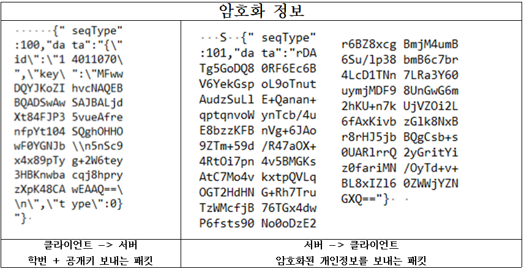

# CapstoneDesign

## Global_Rounge_Door_System

   

###  1. 개발 배경 및 중요성   

 + 편의성 : 사용자 인증방식(IC칩)을 요구  
 하지만 발급의 불편함과 비용발생, 접근성 저하, 등 확장성 또한 고려 되지 않기 때문에   
 휴대폰을 사용한 태그형식(QR코드)을 도입하여 대외협력처 글로벌 라운지의 출입문에 유사 시스템을 구축
  
 + 외부인 출입 통제 : 현재 인증이 되지 않은 사람들도 쉽게 출입
 인증 시스템을 도입함으로써 허가받지 않은 외부인을 통제 
  
 + 데이터 관리 및 사용자 통계 : 현재는 교육 근로자들을 이용하여 학생들의 정보를 일일이 수기로 작성하는 방식을 사용  
   인증시스템을 도입하여 사용자의 정보를 쉽게 저장, 관리가 가능
 
### 2.개발 목표 및 내용  
+ 글로벌 라운지의 무분별한 외부인 출입을 제한하고 자동화 시스템으로 바꿈으로써 데이터를 다양하게 활용 가능.
 
##### 2-1) 클라이언트
 + [Android](https://github.com/zojae031/CapstoneDesign_Global_Rounge_Door_System/tree/android) / [iOS](https://github.com/zojae031/CapstoneDesign_Global_Rounge_Door_System/tree/ios) 어플리케이션 제작
 + QR코드를 이용하여 사용자 인증
 + 사용자 개인정보 암, 복호화
 + 세종대학교 로그인 정보 이용  
 
##### 2-2) [서버](https://github.com/zojae031/CapstoneDesign_Global_Rounge_Door_System/tree/server)
 + 관리자 UI 제공
 + 서버를 구성하여 데이터 관리
 + 클라이언트와 모듈간의 동기화 처리
 + 데이터 암호화  
 
##### 2-3) [모듈](https://github.com/zojae031/CapstoneDesign_Global_Rounge_Door_System/tree/module)
 + 초음파센서를 이용하여 움직임 감지
 + 인증 여부 판단
 + 출입문의 프로토타입 모델 
 
### 3. 기대 효과

+  카드 발급 비용, 시간 절감
+  모바일 이용에 따른 편의성과 이용률 증가
+  자동화된 시스템을 이용하여 통계 추출의 편의성
+  외부인 차단 효과
+  기술의 확장성

  

### 암호화 기법 [RSA]

 + RSA : 공개 키 암호방식  
장점 : 보안성이 뛰어남  
단점 : 길이제한, 속도 느림

+ Encryption 사용방법 ( RSA와 AES의 장점만을 이용 )
1. Client : RSA Key Pair를 생성
2. Client : public Key를 Server로 전송
3. Server : 평문을 RSA로 암호화 (public_key) : encryption
4. Server : 암호화된 평문을 Client로 전송
5. Client : 암호화된 평문을 RSA로 복호화 (private_key) : decryption

    
 
